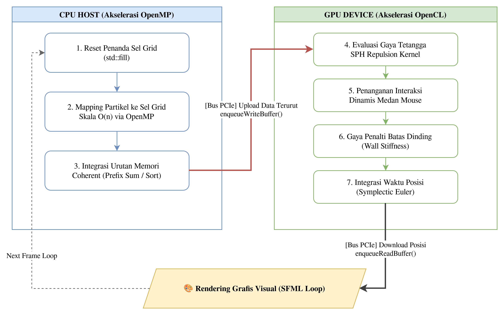

# 🌊 Smoothed Particle Hydrodynamics (SPH) Fluid Simulator

[](https://en.cppreference.com/)
[](https://www.khronos.org/opencl/)
[](https://www.sfml-dev.org/)
[](LICENSE)

Repositori ini berisi proyek Tugas Besar **High Performance Computing (HPC)** berupa simulator fluida real-time interaktif berbasis pendekatan partikel Lagrangian. Proyek ini mengimplementasikan pendekatan **Smoothed Particle Hydrodynamics (SPH) berbasis Gaya Tolak Spiky (*Spiky-Repulsion SPH*)** yang diakselerasi secara masif menggunakan arsitektur paralel heterogen (**CPU + GPU Hybrid** melalui OpenMP dan OpenCL 1.2).

<video src= width="100%" controls autoplay loop muted></video>

---

## 📌 Karakteristik Metode ("Tanpa Kotak" / Gridless)

Berbeda dengan metode berbasis grid statis (*Eulerian*) yang membagi ruang simulasi menjadi kotak-kotak kaku, simulator ini memperlakukan fluida sebagai sekumpulan partikel independen (*Lagrangian Approach*):
* **Gridless:** Setiap partikel bergerak secara bebas membawa besaran fisika berupa posisi $\mathbf{x}$ dan kecepatan $\mathbf{u}$ di dalam ruang kontinu.
* **Tuning Kurva Kernel (Aproksimasi Kuadratik "Spiky"):** Untuk merepresentasikan interaksi tekanan antar-fluida secara interaktif tanpa *looping* densitas yang mahal, gaya tolak antar-partikel diturunkan langsung dari fungsi kernel kuadratik:
  $$f_{\text{repulsion}} = (h - d)^2 \times \text{stiffness} \quad (\text{untuk } d < h)$$
  Di mana $d$ adalah jarak antar-partikel dan $h$ adalah *smoothing length* (radius pengaruh).


---

## ⚙️ Arsitektur & Pipeline Simulasi (Hybrid CPU-GPU)

Alur komputasi dirancang menggunakan pembagian beban kerja (*Load Balancing*) heterogen untuk meminimalkan waktu komputasi per frame:




### Fitur Utama Proyek:
* **Uniform Spatial Grid $\mathcal{O}(n)$ (CPU):** Mengeliminasi pencarian tetangga *brute-force* $\mathcal{O}(n^2)$. Partikel dipetakan ke dalam koordinat sel grid seragam secara paralel memanfaatkan multi-threading OpenMP dengan proteksi `#pragma omp atomic`.
* **Coherent Memory Sorting (CPU):** Melakukan pengurutan array posisi dan kecepatan berdasarkan ID sel grid (*Prefix Sum*). Penataan ini memastikan data partikel yang bertetangga terletak bersebelahan secara fisik di memori, mengoptimalkan efek *L1/L2 Cache Locality* saat dibaca oleh GPU.
* **Interactive Force Fields (GPU):** Mendukung interaksi manipulasi fluida secara langsung menggunakan mouse (Klik Kiri untuk menarik fluida / Klik Kanan untuk menolak fluida) yang dievaluasi secara paralel di dalam kernel GPU.

---

## 💻 Optimasi Komputasi Paralel (HPC Point)

Komputasi interaksi partikel bersifat *embarrassingly parallel*. Proyek ini menerapkan beberapa teknik optimasi level perangkat keras:

* **Work-Group Padding Optimization:** Menerapkan pembulatan ke atas pada ukuran *Global Work Size* di sisi host (C++) agar sesuai kelipatan ukuran *Work-Group* GPU (32 thread), disertai proteksi indeks batas (`if (id >= numParticles) return;`) di sisi kernel `.cl` untuk menghindari isu *Out-of-Bounds memory access* atau kegagalan `CL_OUT_OF_RESOURCES` (-5).
* **Explicit Double-Buffering & Streaming:** Pembaruan data grid dilakukan di RAM Host, kemudian disinkronisasikan ke VRAM GPU melalui `cl::CommandQueue::enqueueWriteBuffer`, mengeksekusi perhitungan fisika masif di GPU, dan langsung ditarik kembali untuk dirender oleh SFML.
* **OpenMP Thread Utilization:** Paralelisasi CPU pada proses pemetaan grid dijadwalkan secara statis (`#pragma omp parallel for schedule(static)`) untuk meminimalkan *overhead* pembuatan thread.

---

## ⚡ Analisis Batasan Performa (Bottleneck Analysis)

Simulator ini mampu menangani hingga **70.000 partikel secara real-time** pada rata-rata hardware modern. Namun, arsitektur ini memiliki karakteristik performa yang krusial:
1. **PCIe Bandwidth Bound:** Karena struktur data grid spasial dibangun ulang di sisi CPU pada setiap frame, terjadi transfer data masif bolak-balik via Bus PCIe (*Host-to-Device-to-Host*) yang menyumbang latensi frame terbesar.
2. **Thread Contention:** Penggunaan operasi atomik (`#pragma omp atomic`) pada CPU memicu sedikit antrean (*bottleneck*) performa saat fluida mengompresi tinggi (terlalu banyak partikel menumpuk di satu ID sel grid tunggal).
---

## 🛠️ Panduan Instalasi & Kompilasi

### Prasyarat Sistem
Pastikan sistem Anda sudah memiliki pustaka dan driver berikut sesuai dengan OS yang digunakan:
* **Compiler:** GCC/G++ (mendukung C++17) atau MSVC (Visual Studio 2022)
* **Graphics Library:** SFML 2.5/2.6
* **HPC SDK:** OpenCL SDK (NVIDIA CUDA Toolkit, AMD ROCm, atau Intel OneAPI)

---

### 🐧 1. Cara Kompilasi di Linux (Ubuntu/Debian)

1. Pasang dependensi melalui terminal:
   ```bash
   sudo apt-get update
   sudo apt-get install libsfml-dev opencl-c-headers ocl-icd-opencl-dev g++
2. Kompilasi menggunakan GCC dengan optimasi -O3:
    ```bash
    g++ -O3 simulasi_fluida.cpp -o simulasi_fluida -lsfml-graphics -lsfml-window -lsfml-system -lOpenCL
3. Jalankan aplikasi:
    ```bash
    ./simulasi_fluida
### 🪟 2. Cara Kompilasi di Windows

Untuk pengguna Windows, Anda dapat memilih salah satu dari dua metode di bawah ini:

#### **Metode A: Menggunakan MSYS2 (MinGW-w64) — Rekomendasi CLI**
Metode ini paling mirip dengan Linux dan menggunakan terminal (GCC).

1. Unduh dan instal [MSYS2](https://www.msys2.org/).
2. Buka terminal **MSYS2 MinGW 64-bit**, lalu instal compiler, SFML, dan OpenCL headers:
   ```bash
   pacman -S mingw-w64-x86_64-gcc mingw-w64-x86_64-sfml mingw-w64-x86_64-opencl-icd
   ```
3. Pastikan *Environment Path* untuk CUDA/OpenCL Anda sudah terdaftar (biasanya otomatis terinstal bersama driver GPU NVIDIA/AMD di `C:\Windows\System32\OpenCL.dll`).
4. Kompilasi file proyek via terminal MSYS2 MinGW dengan optimasi `-O3`:
   ```bash
   g++ -O3 simulasi_fluida.cpp -o simulasi_fluida.exe -lsfml-graphics -lsfml-window -lsfml-system -lOpenCL
   ```
5. Jalankan simulator:
   ```bash
   ./simulasi_fluida.exe
   ```

#### **Metode B: Menggunakan Visual Studio (MSVC) — Rekomendasi IDE**

1. Unduh dan instal [Visual Studio Community](https://visualstudio.microsoft.com/) (Pastikan memilih beban kerja **Desktop development with C++**).
2. Unduh **SFML untuk Visual C++** dari situs resmi SFML, lalu ekstrak ke direktori lokal Anda (misal: `C:\SFML`).
3. Pastikan **CUDA Toolkit** (untuk NVIDIA) atau **OpenCL SDK** sudah terinstal di sistem agar berkas `.h` dan `.lib` tersedia.
4. Buat proyek baru bertipe **Empty Project C++** di Visual Studio.
5. Buka **Project Properties** (Klik kanan pada nama proyek di Solution Explorer -> Properties), lalu lakukan konfigurasi berikut (Pastikan konfigurasi diatur pada mode **Release** dan platform **x64**):
   * **C/C++** ──► **General** ──► **Additional Include Directories**:
     <br>Tambahkan folder `include` dari SFML dan OpenCL SDK. 
     *(Contoh: `C:\SFML\include;C:\Program Files\NVIDIA GPU Computing Toolkit\CUDA\v12.x\include`)*
   * **Linker** ──► **General** ──► **Additional Library Directories**:
     <br>Tambahkan folder `lib` dari SFML dan OpenCL SDK. 
     *(Contoh: `C:\SFML\lib;C:\Program Files\NVIDIA GPU Computing Toolkit\CUDA\v12.x\lib\x64`)*
   * **Linker** ──► **Input** ──► **Additional Dependencies**:
     <br>Masukkan daftar library berikut:
     ```text
     sfml-graphics.lib
     sfml-window.lib
     sfml-system.lib
     OpenCL.lib
     ```
6. Salin semua file `.dll` dari folder `C:\SFML\bin` ke folder tempat file `simulasi_fluida.exe` Anda di-build (biasanya di dalam folder `x64/Release`).
7. Klik **Build & Run** (Gunakan mode **Release / x64** untuk performa simulasi SPH yang maksimal).
---

## 📊 Hasil Pengujian & Benchmarking

*(Contoh format performa simulasi)*

| Jumlah Partikel | Hardware | Local Work Size | FPS | Status |
| --- | --- | --- | --- | --- |
| 10,000 | CPU Single-Thread | - | ~5 FPS | Unstable |
| 10,000 | GPU RTX 3050 | 64 | ~120 FPS | Stable |
| 30,000 | GPU RTX 3050 | 128 | ~60 FPS | Stable |

---

## 📚 Referensi & Kredit Akademik

Pengembangan simulator fluida SPH ini didasarkan pada berbagai literatur ilmiah, paper riset grafis komputer, dokumentasi teknis *High Performance Computing* (HPC), serta materi edukasi visual berikut:

### 📄 Jurnal & Paper Ilmiah Utama
* **Müller, M., Charypar, D., & Gross, M. (2003).** *Particle-Based Fluid Simulation for Interactive Applications*. Department of Computer Science, Federal Institute of Technology Zürich (ETHZ). 
  <br>[Baca Paper (PDF)](https://matthias-research.github.io/pages/publications/sca03.pdf) ── *Paper fondasi untuk implementasi interaktif SPH pada grafika komputer.*
* **Clavet, S., Beaudoin, P., & Poulin, P. (2005).** *Particle-based Viscoelastic Fluid Simulation*. LIGUM, Dept. IRO, Université de Montréal.
  <br>[Baca Paper (Archive PDF)](https://web.archive.org/web/20250106201614/http://www.ligum.umontreal.ca/Clavet-2005-PVFS/pvfs.pdf) ── *Referensi utama untuk pemodelan viskoelastisitas dan interaksi partikel fluida kental.*
* **Koschier, D., Bender, J., Solenthaler, B., & Teschner, M. (2019).** *Smoothed Particle Hydrodynamics: Techniques for the Physics Based Simulation of Fluids and Solids*. Eurographics Tutorial.
  <br>[Baca Tutorial SPH (PDF)](https://sph-tutorial.physics-simulation.org/pdf/SPH_Tutorial.pdf) ── *Panduan komprehensif modern mengenai teknik-teknik canggih dan stabilitas komputasi SPH.*

### ⚙️ Referensi Teknik Komputasi Paralel & HPC
* **Green, S. (2014).** *Particle Simulation using CUDA*. NVIDIA Corporation.
  <br>[Baca Panduan NVIDIA (Archive PDF)](https://web.archive.org/web/20140725014123/https://docs.nvidia.com/cuda/samples/5_Simulations/particles/doc/particles.pdf) ── *Referensi arsitektur data untuk optimasi Spatial Hashing, integrasi grid, dan manajemen memori partikel pada arsitektur paralel GPU.*

### 🎥 Referensi Visual & Media Edukasi
* **Lague, S. (2023).** *Coding Adventure: Fluid Simulation*. YouTube.
  <br>[Tonton Video di YouTube](https://www.youtube.com/watch?v=rSKMYc1CQHE) ── *Referensi visualisasi grafis, penanganan struktur data partikel, dan intuisi implementasi algoritma SPH secara interaktif.*

---

## 📜 Lisensi

Proyek ini dilisensikan di bawah **MIT License** - lihat file [LICENSE](https://www.google.com/search?q=LICENSE) untuk detail lebih lanjut.